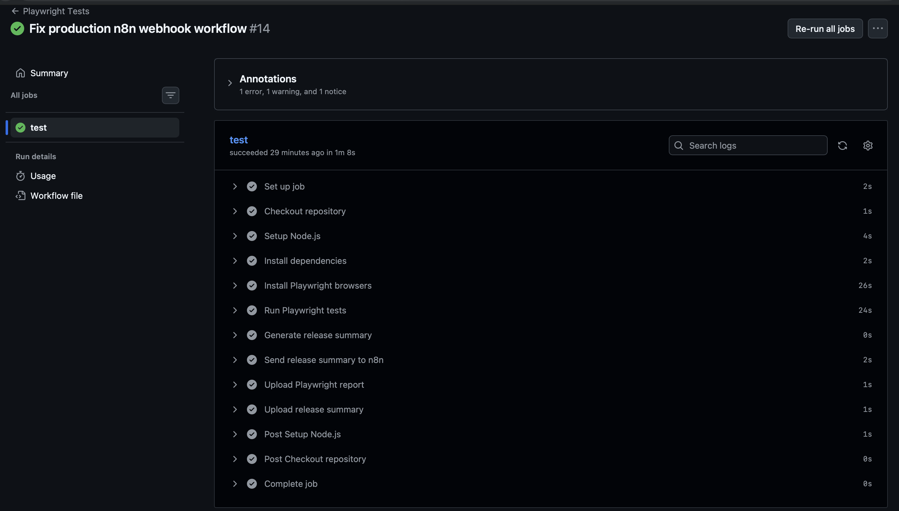
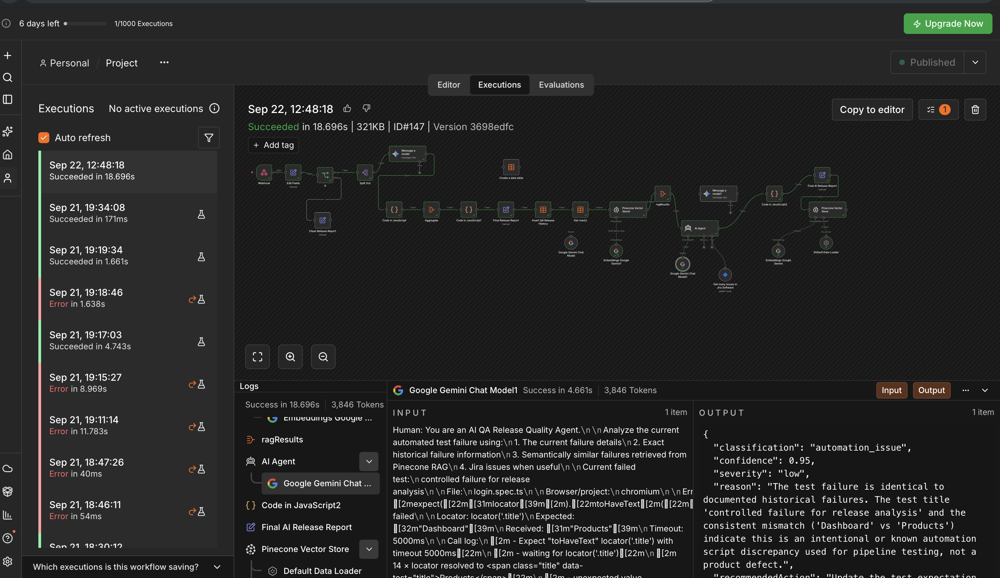
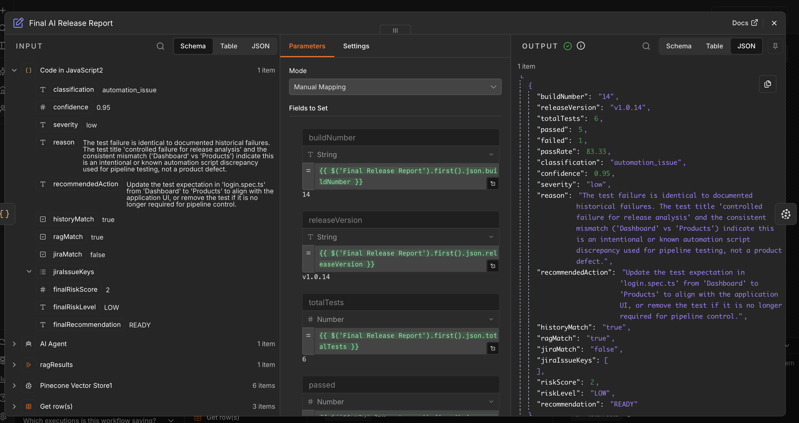
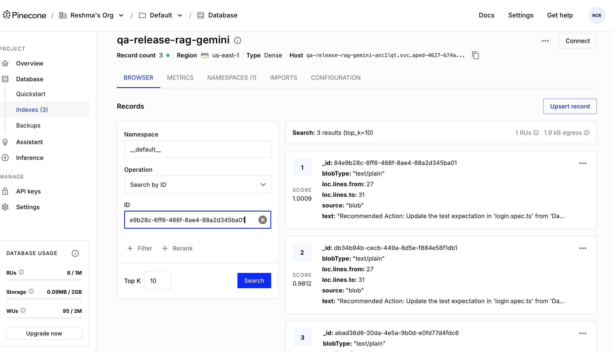

# AI-Powered Release Quality Agent

An AI-assisted software release quality system that analyzes Playwright test failures, retrieves historical failure context, searches semantically similar incidents using RAG, optionally checks Jira issues, classifies the failure using an AI Agent, and calculates a deterministic release-risk decision.

The project combines automated testing, CI/CD, workflow orchestration, Generative AI, structured historical data, vector search, and agent tool usage into a complete release-quality pipeline.

---

## Project Overview

Traditional automated test pipelines usually report only whether tests passed or failed.

This project goes further.

When a Playwright test fails, the system automatically:

1. Runs the tests in GitHub Actions.
2. Generates a structured release summary.
3. Sends the summary to an n8n webhook.
4. Extracts failed tests.
5. Retrieves exact historical failures from an n8n Data Table.
6. Retrieves semantically similar failures from Pinecone using RAG.
7. Passes the failure, history, and RAG context to an AI Agent.
8. Allows the AI Agent to search Jira for related issues.
9. Classifies the failure.
10. Calculates release risk using deterministic logic.
11. Generates a final release-quality report.
12. Stores analyzed failure knowledge back into Pinecone for future retrieval.

The result is an AI-assisted QA release decision such as:

- `READY`
- `REVIEW REQUIRED`
- `BLOCK RELEASE`

---

# Architecture

```text
Playwright Tests
      |
      v
GitHub Actions
      |
      v
Generate Release Summary
      |
      v
n8n Webhook
      |
      v
Normalize Release Data
      |
      v
Check failed > 0
      |
      +----------------------+
      |                      |
      | No failures          | Failures detected
      v                      v
Clean Release Report      Split Failures
                              |
                              v
                       Initial AI Analysis
                              |
                              v
                        Aggregate Results
                              |
                              v
                    Deterministic Risk Logic
                              |
                              v
                     Release Summary Report
                              |
                              v
                    Store Structured History
                         n8n Data Table
                              |
                              v
                    Retrieve Exact History
                              |
                              v
                       Pinecone RAG Search
                              |
                              v
                       Aggregate RAG Results
                              |
                              v
                          AI Agent
                              |
               +--------------+--------------+
               |                             |
               v                             v
        Gemini Chat Model              Jira Tool
               |
               v
        Final AI Classification
               |
               v
        Deterministic Risk Engine
               |
               v
        Final AI Release Report
               |
               v
        Store Knowledge in Pinecone


Technology Stack

| Area                  | Technology               |
| --------------------- | ------------------------ |
| Test Automation       | Playwright               |
| Language              | TypeScript               |
| Framework Design      | Page Object Model        |
| CI/CD                 | GitHub Actions           |
| Workflow Automation   | n8n                      |
| AI Model              | Google Gemini            |
| AI Orchestration      | n8n AI Agent             |
| Structured History    | n8n Data Tables          |
| RAG / Vector Database | Pinecone                 |
| Embeddings            | Google Gemini Embeddings |
| Issue Tracking        | Jira Software Cloud      |
| Source Control        | Git / GitHub             |
| Test Application      | SauceDemo                |


Main Features

Playwright Automation Framework
The automation framework uses Playwright with TypeScript and follows a Page Object Model design.
Example project structure:


release-quality-agent/
├── pages/
│   ├── BasePage.ts
│   ├── LoginPage.ts
│   ├── ProductsPage.ts
│   └── ...
├── flows/
│   └── CheckoutFlow.ts
├── fixtures/
│   └── testData.ts
├── tests/
│   ├── login.spec.ts
│   ├── products.spec.ts
│   └── checkout.spec.ts
├── scripts/
│   └── parseResults.ts
├── .github/
│   └── workflows/
│       └── playwright.yml
├── playwright.config.ts
├── package.json
└── README.md

The current demo contains a controlled failing test that intentionally expects:
Dashboard
while SauceDemo displays:
Products
This controlled failure is used to test the AI release-analysis pipeline.

GitHub Actions CI/CD

GitHub Actions automatically runs the Playwright test suite on pushes and pull requests.
The pipeline performs:
Checkout repository
→ Setup Node.js
→ Install dependencies
→ Install Playwright Chromium
→ Run Playwright tests
→ Generate release summary
→ Send summary to n8n
→ Upload Playwright report
→ Upload release summary

The Playwright step uses:
continue-on-error: true

This is intentional.
A failed automated test should not stop the release-quality analysis pipeline. The failure must continue downstream so n8n and the AI Agent can analyze it.
The workflow uses the production n8n webhook through the GitHub repository secret:
N8N_PRODUCTION_WEBHOOK_URL
No credentials or secret values are committed to the repository.


Release Summary
After the test run, scripts/parseResults.ts creates a structured JSON release summary.
Example:
{
  "build": {
    "buildNumber": "14",
    "branch": "main",
    "commitSha": "example-sha",
    "releaseVersion": "v1.0.14"
  },
  "totalTests": 6,
  "passed": 5,
  "failed": 1,
  "skipped": 0,
  "passRate": 83.33,
  "failures": [
    {
      "title": "controlled failure for release analysis",
      "file": "login.spec.ts",
      "project": "chromium",
      "status": "failed",
      "error": "Expected Dashboard but received Products"
    }
  ]
}

This JSON is posted to the n8n production webhook.


n8n Workflow
The n8n workflow is responsible for orchestrating the complete release-quality analysis.
Main processing flow:

Webhook
→ Edit Fields
→ IF
→ Split Out
→ Gemini failure analysis
→ Code
→ Aggregate
→ Risk calculation
→ Release report
→ Insert QA Release History
→ Get historical rows
→ Pinecone retrieval
→ Aggregate RAG results
→ AI Agent
→ Final risk calculation
→ Final AI Release Report
→ Pinecone knowledge storage

Failure Classification
The AI system classifies each failure into one of the following categories:

product_bug
automation_issue
environment_issue
flaky_test
unknown


product_bug
The application behavior clearly contradicts expected business or documented behavior.

automation_issue
The failure is caused by test code, assertions, selectors, test data, framework logic, or an outdated expectation.

environment_issue
The failure is caused by infrastructure, deployment, network, database, external service, or dependency problems.

flaky_test
Historical evidence indicates intermittent or non-deterministic behavior.

unknown
There is not enough evidence to confidently identify the root cause.
The AI is explicitly instructed not to classify an assertion mismatch as a product bug without supporting evidence.


Historical Failure Storage
Structured analyzed failures are stored in an n8n Data Table.
Current history table:
qa_release_history_v4


Stored fields include:

buildNumber
releaseVersion
testTitle
testFile
classification
confidence
severity
riskScore
riskLevel
recommendation
reason
recommendedAction
recordedAt

This allows the workflow to search for exact historical matches before the final AI decision.
Example:
Current test:
controlled failure for release analysis

Historical result:
automation_issue
confidence: 0.90
severity: low


# RAG with Pinecone

Exact history lookup alone cannot identify failures with different wording but similar meaning.

To solve this, the project uses Retrieval-Augmented Generation.

Pinecone index:

```text
qa-release-rag-gemini
```

The index uses dense vectors generated using Google Gemini embeddings.

Example stored document:

```text
Test: controlled failure for release analysis

File: login.spec.ts

Error:
Expected Dashboard but received Products

Classification:
automation_issue

Confidence:
0.95

Severity:
low

Reason:
The test expectation does not match the actual application UI.

Recommended Action:
Update the expected text in login.spec.ts.

Risk Level:
LOW

Release Recommendation:
READY
```

When another failure occurs, the workflow:

```text
Current failure
→ Gemini embedding
→ Pinecone similarity search
→ Retrieve related historical failures
→ Feed retrieved context to AI Agent
```

The RAG results include similarity scores and relevant historical failure content.

---

# AI Agent

The final analysis is performed using an n8n AI Agent.

The Agent receives:

```text
Current Playwright failure
+
Exact Data Table history
+
Pinecone RAG results
+
Optional Jira context
```

The Agent is connected to:

```text
Google Gemini Chat Model
Jira Software Tool
```

The Agent can therefore reason about the failure and use Jira as a tool when additional issue-tracking context is useful.

Example agent output:

```json
{
  "classification": "automation_issue",
  "confidence": 0.95,
  "severity": "low",
  "reason": "The test failure matches documented historical failures and represents a known automation expectation mismatch.",
  "recommendedAction": "Update the expected text in login.spec.ts from Dashboard to Products.",
  "historyMatch": true,
  "ragMatch": true,
  "jiraMatch": false,
  "jiraIssueKeys": []
}
```

---

# Jira Integration

Jira Software Cloud is connected as an AI Agent tool.

The Agent can search existing Jira issues when it needs additional context.

Example JQL used during testing:

```text
text ~ "login" OR text ~ "Products" OR text ~ "Dashboard"
```

The final report records whether Jira provided relevant evidence:

```json
{
  "jiraMatch": false,
  "jiraIssueKeys": []
}
```

If a related Jira issue is found, the issue key can be included in the final analysis.

---

# Deterministic Risk Engine

The AI does not directly decide whether a release should be deployed.

Instead, the AI provides classification and severity, while deterministic JavaScript logic calculates the risk.

Example scoring logic:

```text
product_bug:
    critical = +50
    high     = +35
    medium   = +20
    low      = +10

environment_issue = +10
flaky_test        = +5
automation_issue  = +3
unknown           = +8
```

A known historical automation issue can receive a small risk reduction.

Example:

```text
automation_issue = 3

historyMatch = true

final score = 2
```

Risk levels:

```text
0 - 20   → LOW
21 - 50  → MEDIUM
51 - 75  → HIGH
76 - 100 → CRITICAL
```

Release recommendations:

```text
LOW      → READY
MEDIUM   → REVIEW REQUIRED
HIGH     → BLOCK RELEASE
CRITICAL → BLOCK RELEASE
```

This keeps the release decision deterministic and auditable.

---

# Final AI Release Report

Example output from the completed end-to-end pipeline:

```json
{
  "buildNumber": "14",
  "releaseVersion": "v1.0.14",
  "totalTests": 6,
  "passed": 5,
  "failed": 1,
  "passRate": 83.33,
  "classification": "automation_issue",
  "confidence": 0.95,
  "severity": "low",
  "reason": "The test failure is identical to documented historical failures. The test title 'controlled failure for release analysis' and the consistent mismatch ('Dashboard' vs 'Products') indicate this is an intentional or known automation script discrepancy used for pipeline testing, not a product defect.",
  "recommendedAction": "Update the test expectation in 'login.spec.ts' from 'Dashboard' to 'Products' to align with the application UI, or remove the test if it is no longer required for pipeline control.",
  "historyMatch": true,
  "ragMatch": true,
  "jiraMatch": false,
  "jiraIssueKeys": [],
  "riskScore": 2,
  "riskLevel": "LOW",
  "recommendation": "READY"
}
```

Although one automated test failed, the system identified the failure as a known low-severity automation issue rather than a product defect.

The release recommendation therefore remained:

```text
READY
```

---

# Example End-to-End Execution

The completed pipeline successfully demonstrated:

```text
6 total tests
5 passed
1 failed
83.33% pass rate

Failure classification:
automation_issue

AI confidence:
0.95

Historical match:
true

RAG match:
true

Jira match:
false

Risk score:
2

Risk level:
LOW

Final recommendation:
READY
```

---

# Setup

## 1. Clone the repository

```bash
git clone https://github.com/chinchu12/release-quality-agent.git

cd release-quality-agent
```

## 2. Install dependencies

```bash
npm install
```

## 3. Install Playwright

```bash
npx playwright install
```

## 4. Configure environment variables

Create a `.env` file:

```env
BASE_URL=https://www.saucedemo.com/
```

Do not commit credentials or API keys.

## 5. Run Playwright locally

```bash
npx playwright test --project=chromium
```

## 6. Generate the release summary

```bash
npx tsx scripts/parseResults.ts
```

The generated summary is stored under:

```text
test-results/release-summary.json
```

---

# GitHub Actions Configuration

Add the production n8n webhook as a GitHub repository secret:

```text
N8N_PRODUCTION_WEBHOOK_URL
```

Example workflow usage:

```yaml
- name: Send release summary to n8n
  if: always()
  run: |
    curl --fail --show-error --silent \
      -X POST \
      -H "Content-Type: application/json" \
      --data-binary @test-results/release-summary.json \
      "${{ secrets.N8N_PRODUCTION_WEBHOOK_URL }}"
```

The production n8n webhook should use:

```text
/webhook/release-quality
```

and not the n8n test endpoint:

```text
/webhook-test/release-quality
```

---

# Security

Secrets are stored outside the source code.

Examples include:

```text
Google Gemini API key
Pinecone API key
Jira API token
n8n production webhook URL
```

GitHub Secrets and n8n Credentials are used for sensitive configuration.

No API keys should be committed to GitHub.

---

# Evidence / Screenshots

Recommended screenshots for the project submission:

```text
docs/
├── github-actions-success.png
├── n8n-full-workflow.png
├── final-ai-release-report.png
└── pinecone-rag-records.png
```


## GitHub Actions

Successful CI/CD execution showing Playwright execution, release summary generation, delivery to n8n, and artifact upload.



## n8n End-to-End Workflow

Successful release-quality workflow execution from webhook ingestion through history lookup, RAG retrieval, AI Agent analysis, deterministic risk calculation, and final reporting.



## Final AI Release Report

Final release analysis showing classification, confidence, historical/RAG matches, risk score, and release recommendation.



## Pinecone RAG Records

Pinecone vector index containing analyzed historical failure knowledge used for semantic retrieval.



## GitHub Actions

Successful CI/CD execution showing:

```text
Playwright tests
Generate release summary
Send release summary to n8n
Upload Playwright report
Upload release summary
```

## n8n Workflow

Successful end-to-end execution showing:

```text
Webhook
→ History
→ RAG
→ AI Agent
→ Risk Engine
→ Final AI Release Report
```

## Final AI Release Report

Shows the final classification, confidence, RAG/history matches, risk score, and release recommendation.

## Pinecone RAG

Shows stored historical failure vectors and similarity search results.

---

# Why This Project Uses Both Data Tables and RAG

The two technologies solve different problems.

## n8n Data Table

Used for structured exact historical lookups.

Example:

```text
Find previous records where:

testTitle =
"controlled failure for release analysis"
```

## Pinecone RAG

Used for semantic retrieval.

It can retrieve related failures even when their wording is different.

For example:

```text
Expected Dashboard but received Products
```

may semantically match:

```text
Post-login page title does not match expected navigation target
```

Using both provides stronger context for the AI Agent.

---

# Why the Release Decision Is Deterministic

The AI Agent performs investigation and classification.

However, the AI model does not directly approve or block the release.

The architecture separates:

```text
AI reasoning
        |
        v
Classification + severity
        |
        v
Deterministic JavaScript risk engine
        |
        v
Release recommendation
```

This design makes the final decision:

```text
predictable
auditable
repeatable
safer for CI/CD usage
```

---

# Project Outcomes

The project demonstrates practical integration of:

```text
Test automation
CI/CD
Workflow orchestration
Generative AI
AI Agents
Tool calling
Historical data
RAG
Vector databases
Issue tracking
Deterministic decision logic
```

Instead of simply reporting a failed test, the system answers:

```text
What failed?
Why did it fail?
Has this happened before?
Are there semantically similar historical failures?
Is there a related Jira issue?
How severe is the failure?
What action should QA take?
How much release risk does it introduce?
Should the release be ready, reviewed, or blocked?
```

---

# Future Improvements

Potential future enhancements include:

```text
Slack release notifications
Human approval workflow
Automatic Jira issue creation for confirmed product bugs
More advanced RAG metadata
RAG reranking
Multiple browser analysis
Failure trend dashboards
Release risk history
Build-to-build comparison
Automatic flaky-test detection
Test ownership mapping
Production monitoring integration
```

---

# Project Status

Current status:

```text
Playwright framework          ✅ Complete
GitHub Actions CI/CD          ✅ Complete
Release summary generation    ✅ Complete
n8n orchestration             ✅ Complete
AI failure classification     ✅ Complete
Structured failure history    ✅ Complete
Pinecone RAG                  ✅ Complete
AI Agent                      ✅ Complete
Jira tool integration         ✅ Complete
Deterministic risk engine     ✅ Complete
Final AI release report       ✅ Complete
End-to-end GitHub execution   ✅ Complete
```

---

# Final Result

The completed system successfully analyzed an intentionally failing Playwright test and determined:

```text
Classification: automation_issue
Confidence: 0.95
Severity: low
History Match: true
RAG Match: true
Jira Match: false
Risk Score: 2
Risk Level: LOW
Release Recommendation: READY
```

This demonstrates an end-to-end AI-assisted release-quality workflow from automated test execution to contextual failure analysis and final release recommendation.